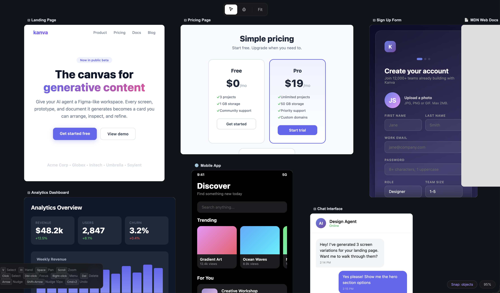

# kanva-editor

**An open-source Figma-like container for generative content.**



AI agents generate a lot of stuff — UI screens, forms, landing pages, dashboards, documents, code. Today that output lands in a chat thread or a file list. There's no good way to **see it all at once**, arrange it spatially, compare versions side by side, or interact with live outputs directly.

kanva-editor is an infinite canvas that serves as a **container for everything your agent produces**. Think Figma, but instead of shapes and vectors, every object on the canvas is a **live artifact** — an HTML page, a running prototype, an image, a generated document. Users can pan, zoom, select, resize, and organize these artifacts exactly like they would in a design tool.

This is the missing layer between your AI agent and your user.

## The Problem

When an agent generates 10 screens, a form, and an API doc in one session, where does it all go?

- **Chat UI** — output is linear, buried in a scroll. You can't see two things at once.
- **File browser** — output is a flat list. No spatial context, no visual comparison.
- **Existing canvas libs** — built for drawing (shapes, arrows, sticky notes), not for rendering live web content.

What you actually want is a **2D workspace** where every generated artifact is a card you can see, arrange, zoom into, and interact with — and where the agent can keep adding, updating, and refining cards as it works.

## What kanva-editor Does

It's an open-source editing kernel built on [Konva.js](https://konvajs.org/) that gives you:

**A Figma-grade interaction layer** — pan, zoom, select, multi-select, drag, resize, snap, align, undo/redo, keyboard shortcuts, context menus. All the editing UX users expect from a spatial canvas.

**Live content rendering** — cards aren't just rectangles. They render real content:

```ts
// A static screenshot
{ kind: 'image', src: 'https://...' }

// A live website in a sandboxed iframe
{ kind: 'url', url: 'https://my-app.vercel.app' }

// Raw HTML from your agent, rendered live
{ kind: 'html', html: '<html><body>...</body></html>' }
```

When zoomed in, HTML and URL cards mount **live iframes** positioned over the canvas. When zoomed out, they fall back to lightweight thumbnails. You get interactive content at close range and a fast overview at a distance.

**A card-first data model** — every object is a typed business artifact with its own content, capabilities, resize rules, and menu actions. Not a generic shape with a text label.

**Agent integration primitives** — provenance tracking (which prompt created which card), revision history, an intent bus for product actions (view code, export, download), and a serialization layer for persistence.

## Who This Is For

You're building a product where an AI agent generates visual or interactive artifacts, and you need a canvas for users to work with them. Examples:

- **AI design tools** — the agent generates screens; users arrange and refine them on a canvas
- **Prototyping environments** — live HTML prototypes as draggable, resizable cards
- **Document workspaces** — generated docs, specs, and reports laid out spatially
- **Low-code/no-code builders** — each card is a live component the user can configure
- **Multimodal agent UIs** — a spatial container for everything the agent produces

## Architecture

```
EditorStore        Normalized records, transactions, snapshots
    |
EditorCore         Selection, camera, card CRUD, history, snapping
    |
ToolStateMachine   select.idle -> pointing -> dragging -> commit
    |
CardPlugin         Per-type behavior: resize policy, menus, overlays
    |
KonvaAdapter       Canvas rendering + LiveOverlayManager (iframes)
    |
React Shell        DOM UI: context menus, toolbars, hooks
```

The core has **zero dependency on Konva or React**. The rendering adapter and React hooks are separate layers. You could swap the renderer without touching the editing logic.

## Install

```bash
npm install kanva-editor konva
```

## Quick Start

```ts
import {
  EditorStore, EditorCore, PluginRegistry, HistoryManager, KonvaAdapter,
  ScreenCardPlugin,
} from 'kanva-editor'

const store = new EditorStore({ records, runtime })
const plugins = new PluginRegistry()
plugins.register(new ScreenCardPlugin())

const editor = new EditorCore({ store, plugins, history: new HistoryManager() })

const adapter = new KonvaAdapter()
adapter.mount({ container: document.getElementById('canvas')!, editor })

// Agent generates a card with live HTML
editor.createCards([{
  id: 'card_1',
  type: 'screen',
  title: 'Generated Sign Up Form',
  x: 100, y: 100, width: 400, height: 560,
  zIndex: 1,
  visible: true, locked: false, favorite: false,
  createdAt: Date.now(), updatedAt: Date.now(),
  content: {
    kind: 'html',
    html: agentOutput.html, // raw HTML string from your agent
  },
  capabilities: {
    selectable: true, focusable: true, movable: true, resizable: true,
    exportable: true, downloadable: true, viewCode: true, liveOverlay: true,
  },
}])
```

The card appears on the canvas. The user can drag it, resize it, zoom into it to see the live interactive form, right-click for actions, and select it to target follow-up prompts at it.

## Interactions

| Input | Action |
|---|---|
| Click card | Select |
| Double-click card | Focus (zoom in + resize handles) |
| Drag card | Move |
| Drag handle | Resize |
| Right-click card | Context menu |
| Scroll wheel | Zoom at pointer |
| Space + drag | Pan |
| Arrow keys | Nudge (Shift = 10px) |
| Cmd/Ctrl + Z | Undo / Redo |
| Delete | Delete selected |

## Development

```bash
git clone https://github.com/nicognaW/kanva-editor.git
cd kanva-editor
npm install
npm run demo         # demo at localhost:3100
npm run dev          # watch mode build
npm run test         # 79 tests
npm run check        # typecheck + lint + format + test
```

## Contributing

See [CONTRIBUTING.md](CONTRIBUTING.md).

## License

MIT
